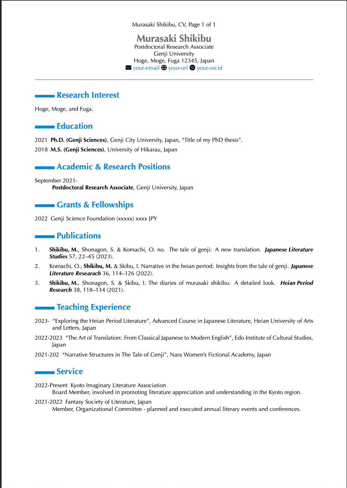

[](https://opensource.org/licenses/MIT)

# Quarto Markdown CV
---

Please note that the information here is made up for the template.

[](https://github.com/mattocci27/quarto-cv/blob/gh-pages/Shikibu_CV.pdf)

## Instructions

Customize the CV with your personal information.

```bash
vim sources/cv1.md
vim sources/cv2.md
vim sources/ref.md
vim sources/ref.bib
```

### Bibtex Support

This template allows you to use a Bibtex file (ref.bib) for bibliographic entries in your CV.
An author name specified in the `Makefile` and in the `.github/workflows/compile.yml` under `AUTHOR=` will be highlighted in bold (e.g., `AUTHOR='Shikibu, M.'`).

### PDF Rendering with GitHub Actions

PDF rendering of your CV is executed automatically via GitHub Actions.
Upon any push events from the `main` branch, your CVs will be compiled, built, and deployed to the `gh-pages` branch.

The GitHub Actions workflow uses `macos-latest` because the template is designed to use the Optima font.
If you prefer to use a different operating system, such as Linux (`ubuntu-latest`), you can modify the workflow and template files and choose from other free fonts.

Please note that local building is not required for this process.
However, if you wish to build the project locally, you can use the command:

```bash
make
```

## Requirements

To compile this project locally, the following dependencies are necessary:

- [Quarto](https://quarto.org)
- [TinyTeX](https://yihui.org/tinytex/)

